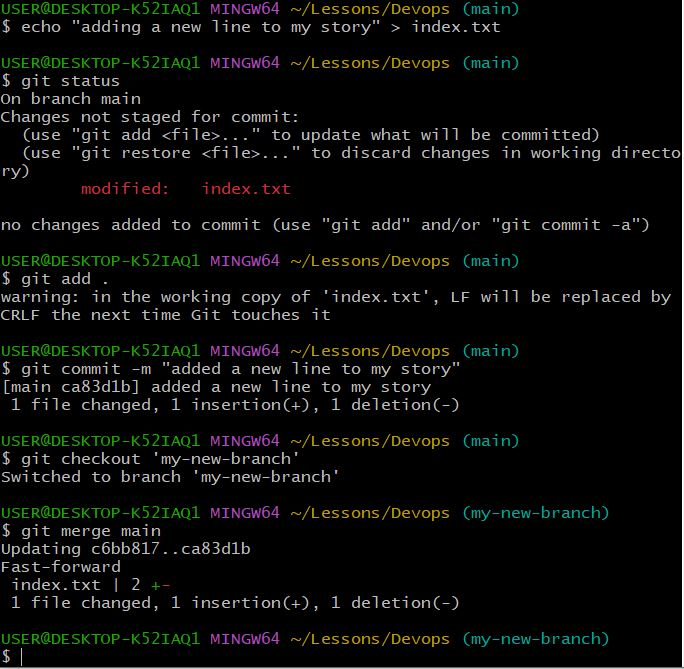
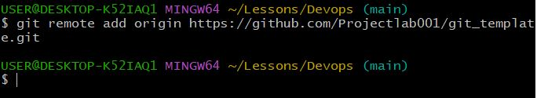

# INITIALIZING A REPOSITORY AND MAKING COMMITS

WHAT IS GIT?

Git is a version control system that allows you to keep track of changes made in your code. It also helps you collaborate with other developer. Before Git, there were other technologies available that solves this problem and a good example is SVN. Git adopted a differench approach from that of SVN which allows developers to make their copies of the central repository, and that is why it is referred to as a Distributed Version Control System.

## INITIALIZING A GIT REPOSITORY 

#### Before we can initialize a git repository, we must have installed git on our computer. After installing, to initialize a repo. We follow the below steps;

- We open a terminal on our computer e.g Git bash; the default terminal after downloading and installing Git.

- We open the terminal and create a working folder or directory e.g DevOps folder using this command mkdir DevOps.

- After creating the folder or directory, we'll have to change or move into the working directory using this command cd DevOps.

- While inside the folder/directory, we use the git init command to initialize our repository.

## MAKING THE FIRST COMMIT 

In the picture above, we successfully created our working directory and initialized a git repository. Now we will make our first commit. In git, commit simply means saving the changes (adding, modifying or deleting files or text) you made to your files. When we make a commit, git takes a snapshot of the current state of our repository and saves a copy in the .git folder inside our working directory.

- Now, let's make our first commit by following the below steps;

- Inside our working directory, we create a new file called index.txt using this command 'touch index.txt.'

- After creating, input any text in the text file.

- Then we add the changes to git staging area using this command 'git add' .

- To commit the changes to git, we use this command git commit -m "Initial commit". The -m option/flag is used to add a commit message. The commit message provides context about the commit.

 

The -m fiag is used to provide a commit message. The commit message is a nice way to provide context about the commit. When writing a commit message, make it descritive as possible. Let it explain why the commit was made.

## WORKING WITH BRANCHES

- In git, branches are used to create a different copy of our source code. In the new branch we can make changes as we please. Git branch is also commonly used in the aspect of software development to develop new feautures of applications. It is also an important tool for collaboration within remote teams i.e developers working from different location, they can make different branches while working on the same feature and later merge their branches at the end of the day.

## MAKING OUR FIRST GIT BRANCH 

- To make a new branch, we use this command 'git checkout -b'. The -b flag helps to create and change directly into the new branch

## LISTING OUR GIT BRANCHES

To show the lists of our branches on our local git repository we use the this command 'git branch'.

## CHANGING INTO AN OLD BRANCH

To change into an existing or old branch, we use the command below;

'git checkout [branch_name]'

## MERGING A BRANCH INTO ANOTHER BRANCH 

Assuming we have two branches A and B, and we want to add the content of B to A. First we change into branch A and run the command below;

'git merge B'

## DELETING A GIT BRANCH

When the code in a branch has been tested and merged into a staging or development environment depending on the branch strategy of the team, the branch is usually deleted. A git branch can be deleted with the command below;

'git branch -d [branch_name]'

# COLLABORATION AND REMOTE REPOSITORIES

## CREATING A GITHUB ACCOUNT

The steps for creating a github account are listed below;

- Head over to github.com to create a Github account.

- Then you enter your username, password and email.

- Next you verify your identity.

- Then click on the create button to create your Github account.

- Input activation code sent to the email you provided.

- Select your preferences and click continue.

- Lastly, you click "continue for free" for the free tier.

step 1  

step 2  

step 3  

step 4 

step 5 

step 6 

## CREATING FIRST REPOSITORY

To create a repository on github, the steps are as follows;

- Click on the plus sign at the top right corner of the github account then a drop down mwnu will appear, select new repository.

- Fill out the form by adding the repository name, description and ticking the box to add a readme.md file.

- Finally, you click the create repository button to create the repository.

## PUSHING LOCAL GIT REPOSITORY TO REMOTE GITHUB REPOSITORY 

- To add a remote repository to the local repository, we use this command;

'git remote add origin [link-to-github-repo]'

To get the remote link click on the green botton code, copy the https link. A screenshot is shown below.

After commiting changes in the local repo, we push the content to the remote repo using the command below;

'git push origin [branch_name]'

The process would look like the image below;

 

## CLONING REMOTE GIT REPOSITORY

To clone a git repository we use the below command

'git clone [link-to-remote-repository]'

 

## BRANCH MANAGEMENT AND TAGGING

### INTRODUCTION TO MARKDOWN SYNTAX

Markdown syntax is commonly used for creating document, README files, forum posts and even web pages.

1. Heading: To create headings, we use the hash (#) symbol, e.g.

            # Heading 1 

            ## Heading 2

            ### Heading 3

   

2. Emphasis: To create emphasis, the asterisks (*) or underscore (_) is used e.g.

- *Italicized Text* or _Italicized Text_

-     **Bold Text**

3. Lists: To create an unordered list, we use the hyphen (-) symbol e.g.

        - Item 1
        - Item 2
        - Item 3

For the ordered list, we use the numbers e.g. 

1.First item

2.second item

3.Third item

4. Links: To create hyperlinks, we use square brackets ([]) for the link text, followed by the paranthesis () containing the URL e.g.

       [visit darey.io](https://www.darey.io)

5. Images: To display an image, use an exclamation mark (!) followed by a square bracket ([]) for the alt text and the paranthesis for the image URL e.g. 

       

6. Code: To display codes or snippets, we use backicks (``) to enclose the code e.g.

       `console.log('Welcome to darey.io')`

 

