# WEB STACK IMPLEMENTATION (LAMP STACK) 

## LAMP STACK IMPLEMENTATION (Linux, Apache, MySQL and PHP)

### PREREQUISITES

- Cloud Service Provider - AWS.
- Launch a Linux Instance (Ubuntu preferably).
- Prior knowlwdge on how to SSH into a virtual host.

## STEP 1 - INSTALLING APACHE AND UPDATING THE FIREWALL

Update a list of packages in package manager.

'sudo apt update'

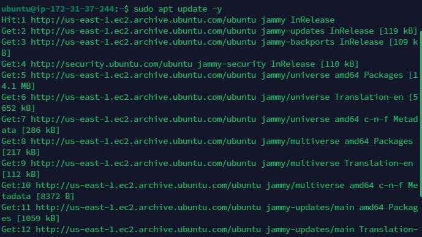 
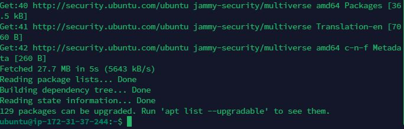

Run Apache2 package installation.

'sudo apt install apache2'

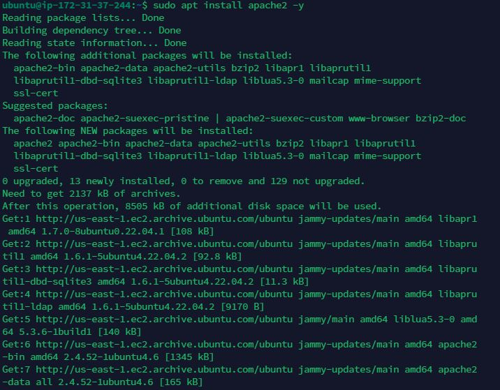

 We need to verify that apache2 is running as a service in our OS. To do that we use this command;

 'sudo systemctl status apache2'

 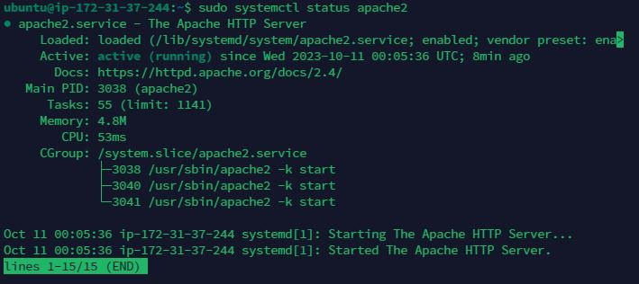

 Our server is running and we can access it locally and from the internet.Before we can receive any traffic by our Web Server, we need to open TCP port 80 which is the default port web browsers use to access web page on the internet. Now we need to check how we can access it locally in our ubuntu shell. To do that we use the command;

' curl http://localhost:80 or curl http://127.0.0.1:80'

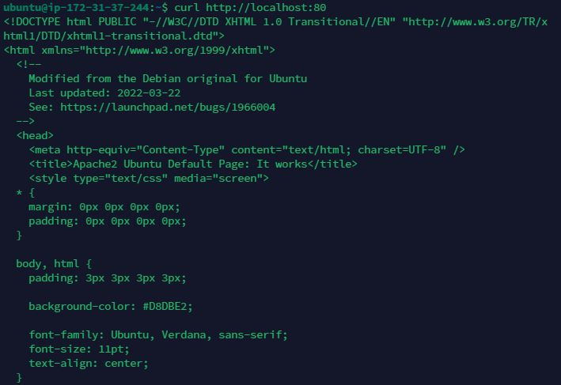

Now, we have to test how our Apache HTTP server can respond to requests from the internet, to do so we go to any browser and use the below command;

    'http://<Public-IP-Address>:80'
curl -s http://169.254.169.254/latest/meta-data/public-ipv4

The URL in browser shall also work if you do not specify port number since all web browser use port 80 by default.

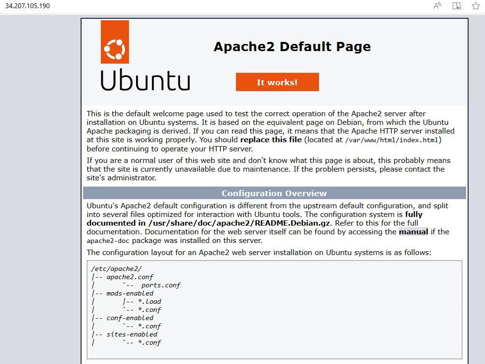

## STEP 2 - INSTALLING MySQL [DATABASE MANAGEMENT SYSTEM]

We install MySQL using Ubuntu's package manager.

'sudo apt install mysql-server'

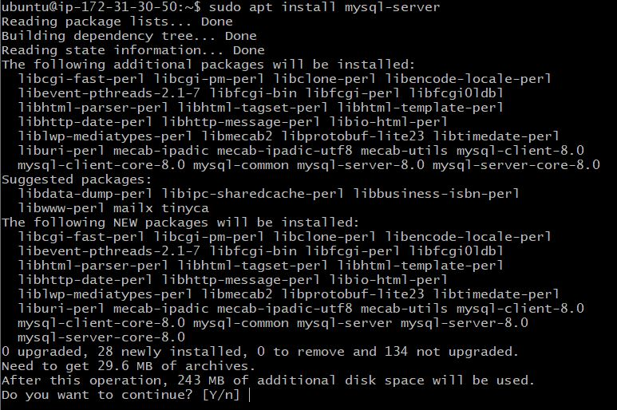 

After installation, we log in to the MySQL console by typing;

'sudo mysql'

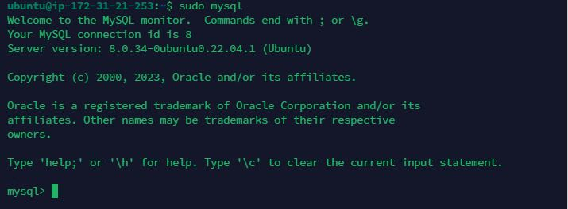 

It is also recommended to run a security script that comes pre-installed with the MySQL. Before running the script, we have to set a password for the root user, using mysql_native_password as default authentication method. To do that the command below is used;

ALTER USER 'root'@'localhost' IDENTIFIED WITH mysql_native_password BY 'PassWord.1';

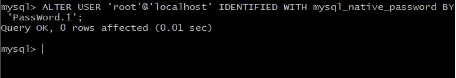 

Then we exit the console by typing;

'mysql> exit'

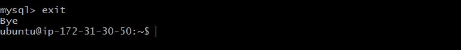 

After running the security script, we start the interactive script by running the command below;

'sudo mysql_secure_installation'

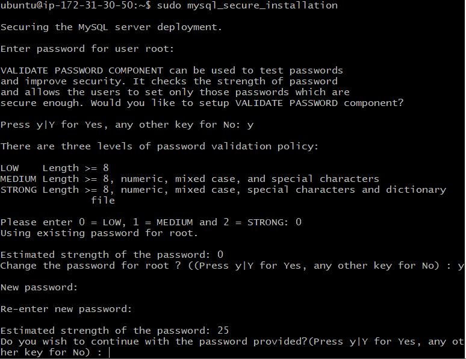
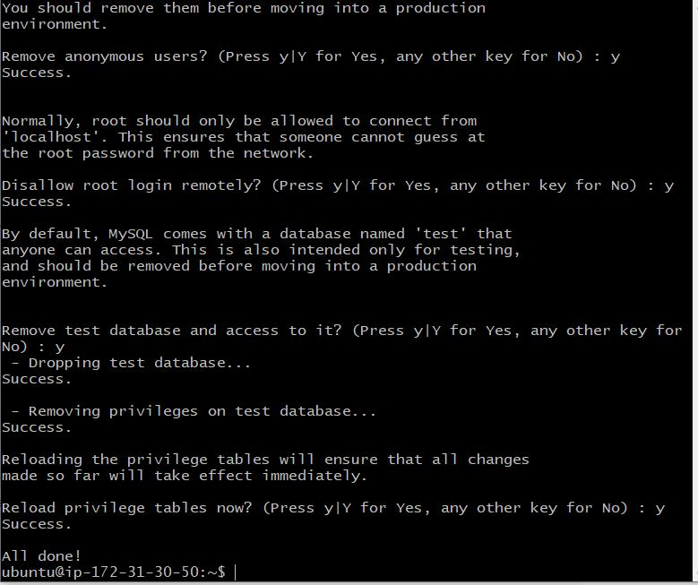

When finished with the script process, the next step is to test if we're able to log into the MySQL console by typing;

'sudo mysql -p'

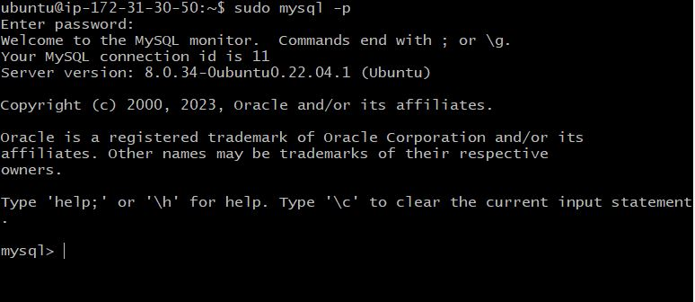 

Then we exit the console by typing;

mysql> exit

## STEP 3 - INSTALLING PHP

To install php and other packages together, we use the command below;

'sudo apt install php libapache2-mod-php php-mysql'

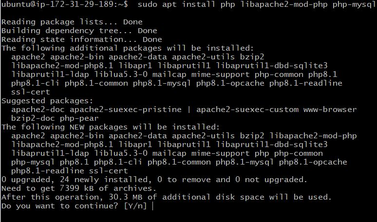
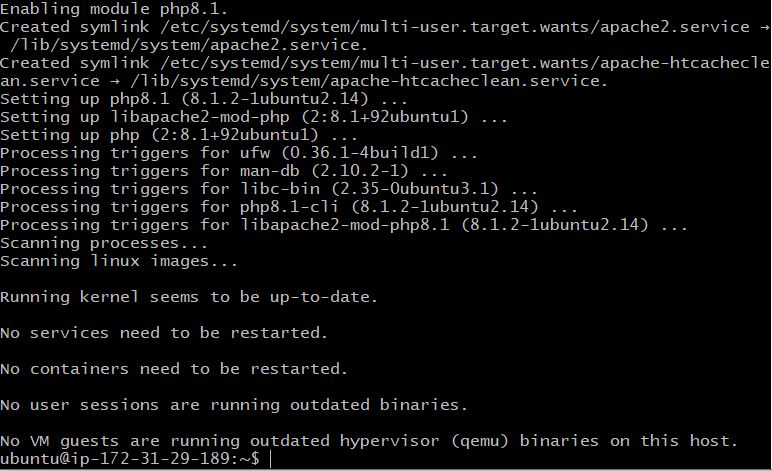

Once the installation is finished, we have to check the PHP version by using the command below;

'php -v'

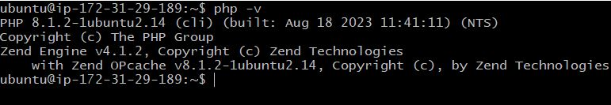

## STEP 4 - CREATING A VIRTUAL HOST FOR THE WEBSITE USING APACHE

We'll set up a domain called projectlamp using the command below;

'sudo mkdir /var/www/projectlamp'

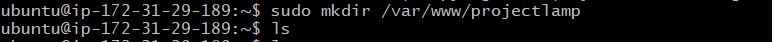

Next we assign ownership of the directory user using the command below;

'sudo chown -R $USER:$USER /var/www/projectlamp'

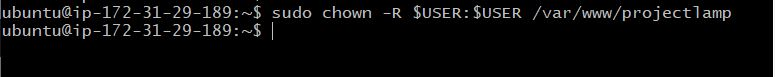

Then we create and open a new configuration file in Apache's site-available directory using the command below;

'sudo vi /etc/apache2/sites-available/projectlamp.conf'

Then paste the following command in the file;

<VirtualHost *:80>

ServerName projectlamp

ServerAlias <www.projectlamp>

ServerAdmin webmaster@localhost

DocumentRoot /var/www/projectlamp

ErrorLog ${APACHE_LOG_DIR}/error.log

CustomLog ${APACHE_LOG_DIR}/access.log combined

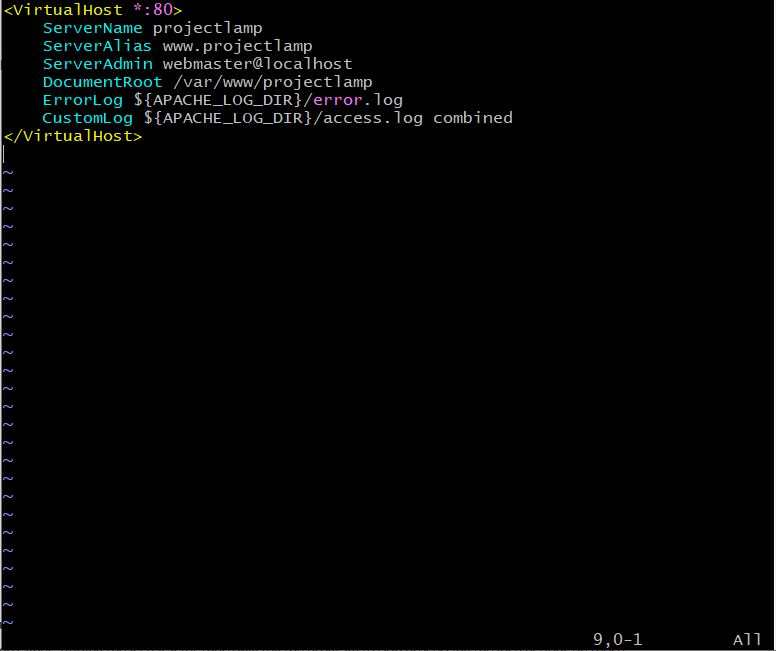

Then we use the ls command to show the new file in the present directory;

' sudo ls /etc/apache2/sites-available'

Now, we enable the new virtual host using the command below;

'sudo a2ensite projectlamp'

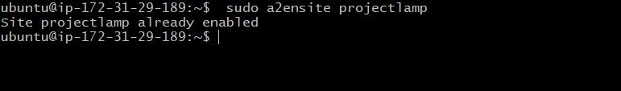

Next, we have to disable apache's default website using the command below;

'sudo a2dissite 000-default'

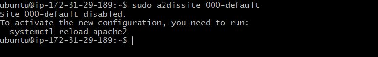

To make sure our configuration file doesn't contain syntax errors, we use the command below;

'sudo apache2ctl configtest'

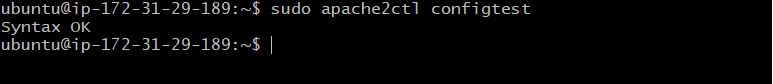

Finally, we reload apache so the changes can take effect using the command below;

'sudo systemctl reload apache2'

But our new website is now active, but the web root/var/www/projectlamp is still empty. So we create an index.html file in that location so that we can test that the virtual host works as expected. To do that we run this command below; 

sudo echo 'Hello LAMP from hostname' $(curl -s http://169.254.169.254/latest/meta-data/public-hostname) 'with public IP' $(curl -s http://169.254.169.254/latest/meta-data/public-ipv4) > /var/www/projectlamp/index.html

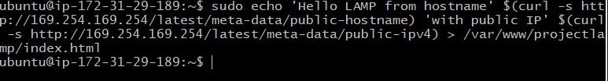 

After that, we go to our browser to confirm if the website is now active

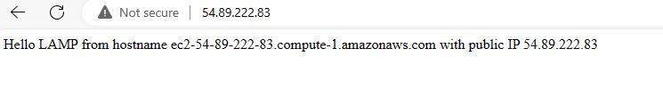

The image above indicates that the website is active.

## STEP 5 - ENABLE PHP ON THE WEBSITE

To do this we have to change the default behaviour by editing the dir.conf file using the command below;

'sudo vim /etc/apache2/mods-enabled/dir.conf'

And changing the values from this;
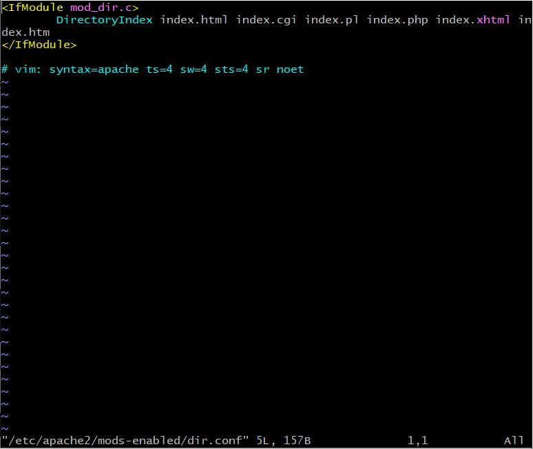
To this;
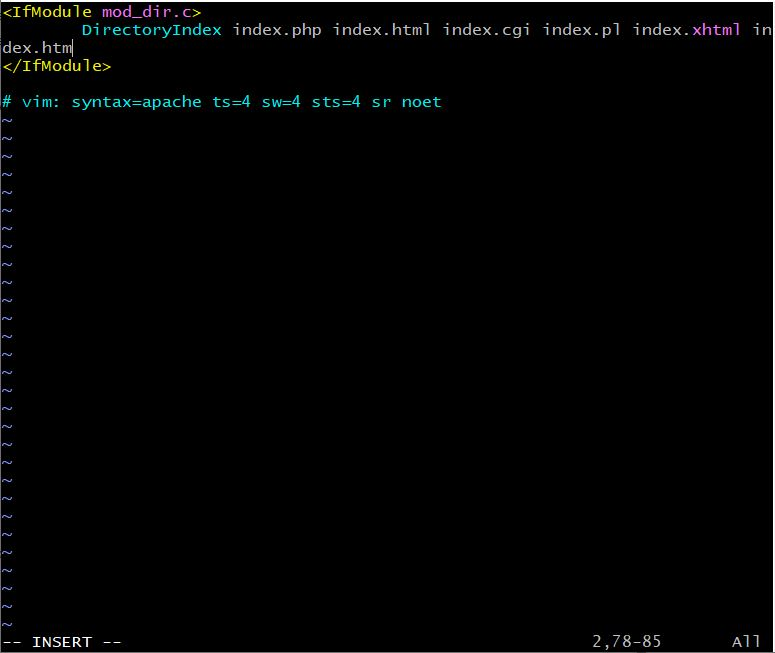

After saving and closing the file, we'll have to reload apache so the changes can take effect by using the command below;

'sudo systemctl reload apache2'

Finally, we'll create a php script to test that it is correctly installed and configured on our server using the command below

'vim /var/www/projectlamp/index.php'

And pasting the following text in it;

    **<?php
    phpinfo();**

When finished, we go to our browser and refresh the page and a page similar to this will be displayed;

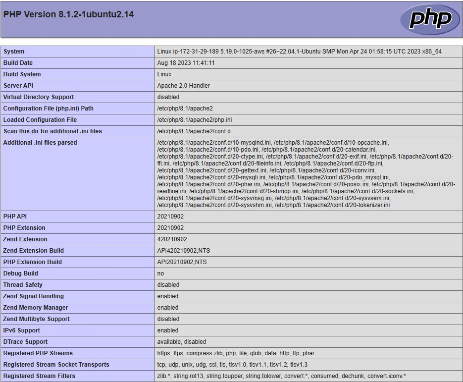

 After checking the relevant information, it is best to remove the file created cause it contains sensitive information about our PHP environment and Ubuntu server. To do so, we use the below command;

' sudo rm /var/www/projectlamp/index.php'

