# INTRODUCTION TO SHELL SCRIPTING AND USER INPUT

## SHELL SCRIPTING SYNTAX ELEMENTS 

1. VARIABLES 

Variables are used to store data of different types such as numbers, string and arrays. We can assign a value to a variable using the = operator and access the value using the variable name preceeded by a $ sign.

-  To assign value to a variable;

    name="John"

- To retrieve the value from the variable;

     echo $name

2. CONTROL FLOW

Control flow statements allow us to make decisions, iterate over list, and execute different commands based on conditions.

- Using if-else to execute script based on conditions: Run;

        #!/bin/bash

        # Example script to check if a number is positive, negative, or zero

        read -p "Enter a number: " num

        if [ $num -gt 0 ]; then
            echo "The number is positive."
        elif [ $num -lt 0 ]; then
            echo "The number is negative."
        else
            echo "The number is zero."
        fi

The code above then prompts the user to input a number, and then prints the statement stating whether the number is positive or negative.

-  Iterating through a list using a for loop: Run;

        #!/bin/bash

        # Example script to print numbers from 1 to 5 using a for loop

        for (( i=1; i<=5; i++ ))
        do
            echo $i
        done

The result for the command looks like the image below;

3. COMMAND SUBSTITUTION

Command substitution allows us to capture the output of a command and use it as a value within our script. We can use the backtick or the $() syntax for command substitution.

-  Using backtick for command substitution;

        current_date=`date +%Y-%m-%d`

The command above prints the date using the Year, month and date format.

- Using $() syntax for command substitution;

        current_date=$(date +%Y-%m-%d)

The command above does the same thing with the backtick format.

4. INPUT AND OUTPUT

To accept user input, we use the read command, output text to the console using the echo command. Additionally we can redirect input and output using operators like > (output to a file), < (input from a file) and | (pipe the output of one command as input to another)

- Accept user input: Run;

        echo "Enter your name:"
        read name

The above command prompts the user to input a name, then displays the result on the terminal.

- Output text to the terminal: Run;

        echo "Hello World"

The above command prints out the text in the parantheses on the terminal.

- Output the result of a command into a file;

We run the command below;

    echo "hello world" > index.txt

- Pass the content of a file as an input to a command;

Run;

    grep "pattern" < input.txt

- Pass the result of a command as an input to another command;

Run;

    echo "hello world" | grep "pattern"

5. FUNCTIONS

Functions are used to modularize codes and make it more reusable, we can define a function using the function keyword or simply by declaring the function name followed by parentheses.

    #!/bin/bash

    # Define a function to greet the user
    greet() {
        echo "Hello, $1! Nice to meet you."
    }

    # Call the greet function and pass the name as an argument
    greet "John"

## WRITING OUR FIRST SHELL SCRIPT

Step 1: On the terminal we create a folder called shell-scripting using the command 'mkdir shell-scripting.'

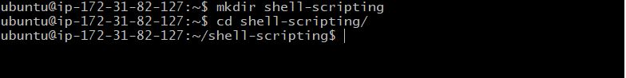

STEP 2: We then create a new file called user-input.sh using the command 'touch user-input.sh.'

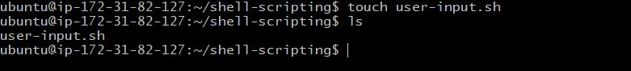

STEP 3: After creating, copy and paste the block of code below into the file;

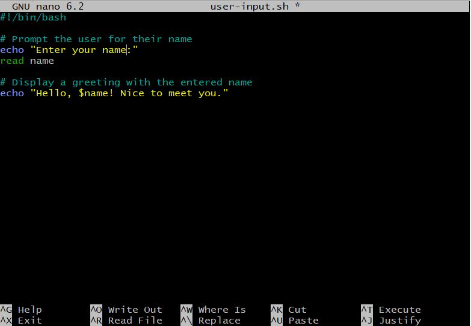

The code above prompts for the user's name and then display's a greeting with the provided name.

STEP 4: Save the file

STEP 5: Run the command 'sudo chmod +x user-input.sh' to make the file executable.

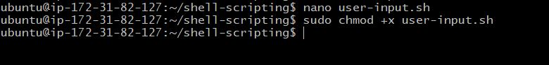

STEP 6: To run the script, we use the 'command ./userinput.sh.'

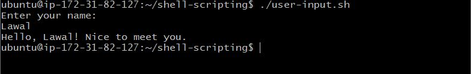

## DIRECTORY MANIPULATION AND NAVIGATION

STEP 1: Create a file named' navigating-linux-filesystem.sh.'

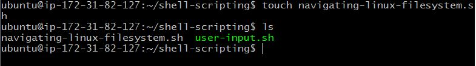

STEP 2: Paste the code below in the file;

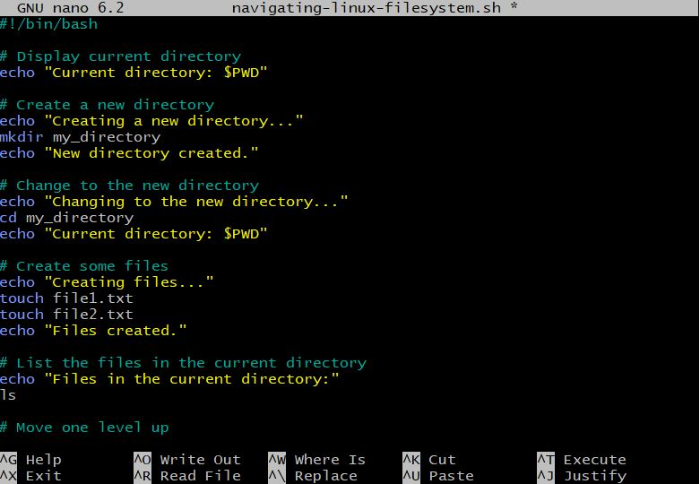

STEP 3: Then we make the file executable by running 'sudo chmod +x navigating-linux-filesystem.sh.'

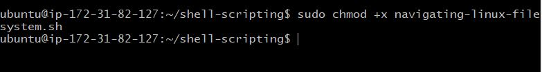

STEP 4: To run the script, use the command; ./navigating-linux-filesystem.sh.

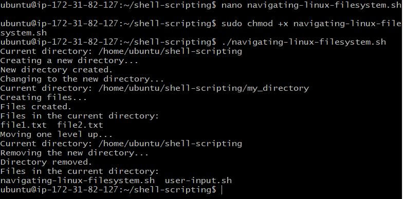

## FILE OPERATIONS AND SORTING

STEP 1: Create another shellscript file called sorting.sh.

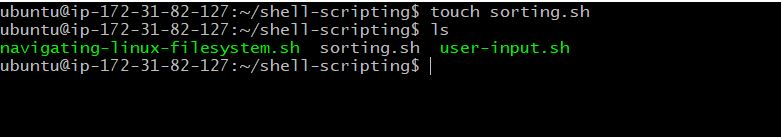

STEP 2: Copy and paste the block of code in the newly created file;

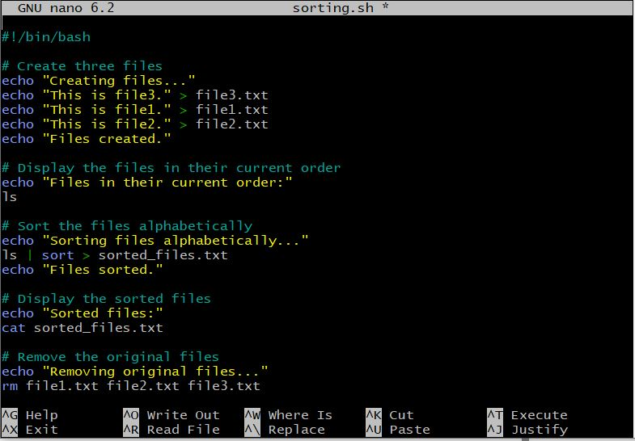

STEP 3: Set execute permission on the file using the command 'sudo chmod +x sorting.sh.'

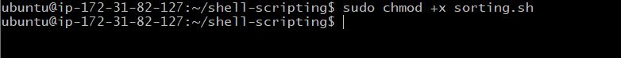

STEP 4. Run the script using the command ./sorting.sh.

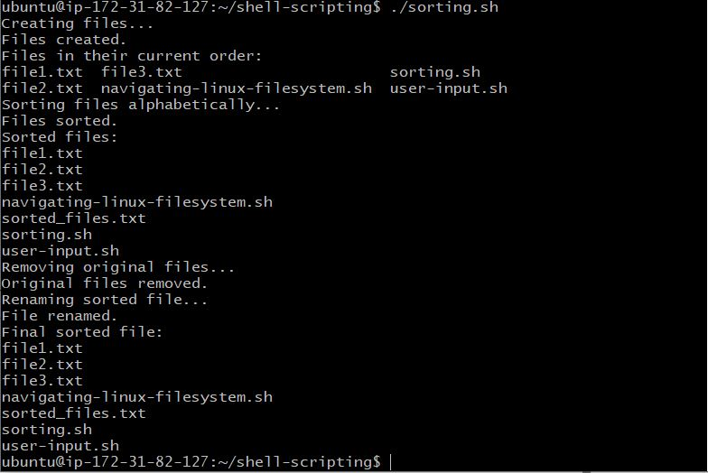

## WORKING WITH NUMBERS AND CALCULATIONS

STEP 1: We create a new file called 'calculations.sh.'

STEP 2: Copy and paste block of code in the file.

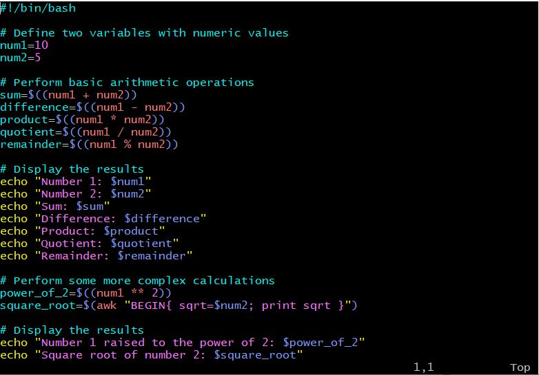

STEP 3: Make it an executable with the command 'sudo chmod +x calculations.sh.'

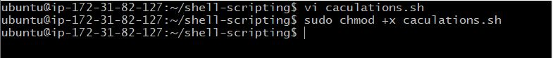

STEP 4: Finally, to run the script, you can type ./calculations.sh into your terminal.

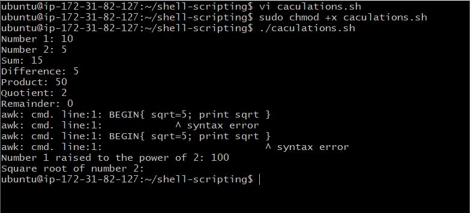

## FILE BACKUP AND TIMESTAMPING

STEP 1: Let's create a file named 'backup.sh.'

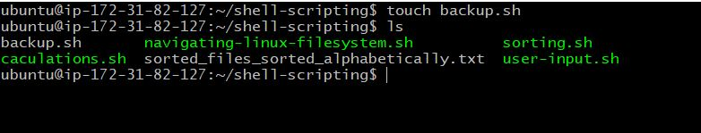

STEP 2: Copy and paste the block of codes into the file.

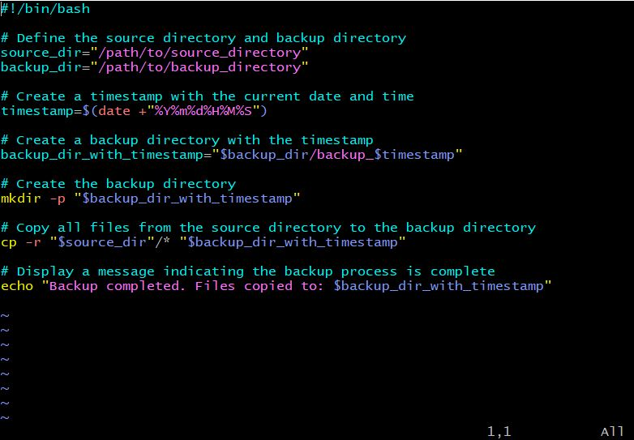

STEP 3: Set execute permission on the file using sudo chmod +x backup.sh.

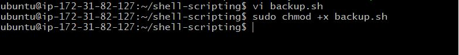

STEP 4: Run the script using ./backup.sh

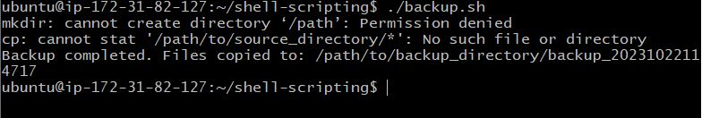
