# UNDERSTANDING CLIENT-SERVER ARCHITECTURE

## Client Server Architecture With MySQL

### What is Client-server architecture?

Client-server refers to an Architecture in which two or more computers are connected over a network to send and receive request  between one and another.

In their communication, each machine has its own role : The machine sending the request is referred to as the *CLIENT and the machine responding(serving) is referred to as the SERVER.

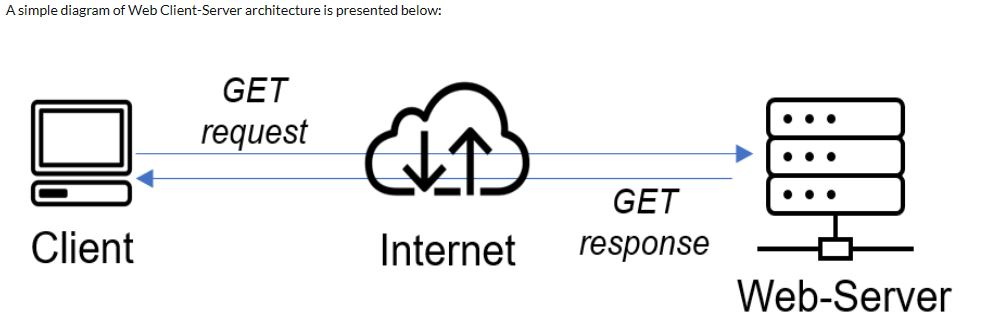

If we extend this concept further and add a Database server to our architechure, we can get this picture below;

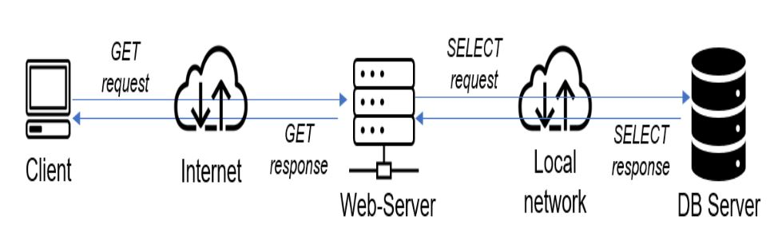

## IMPLEMENTING CLIENT-SERVER ARCHITECTURE USING MYSQL DATABASE MANAGEMENT SYSTEM (DBMS)

### To demonstrate basic client-server using MySQL RDBMS

### create and configure two linux based Virtual servers(EC2 instances on AWS)

- Server A name MySQL-Server for the serving machine

- Server B name MySQL-Client for the requesting machine

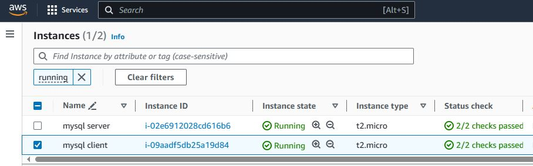

1. Connect to MySQL-Server and Install MySQL software

        'sudo apt update'

Run 'sudo apt install mysql-server' to install Mysql software 

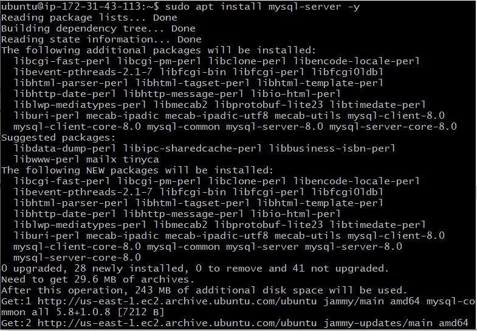

Enable the MySQL.service after installing

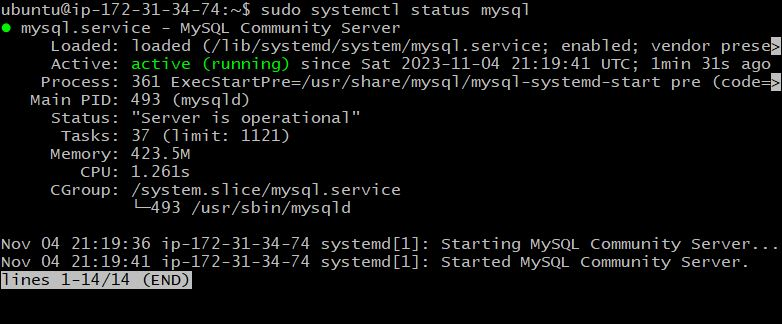

2. Connect to Mysql-client and install client server software.

        'sudo apt update'

Run 'sudo apt install mysql-client' to install mysqlclient.

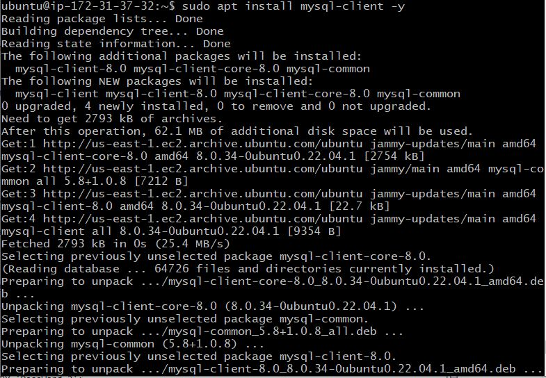

3. By default, both EC2 virtual servers are located in the same local virtual network, so they can communicate to each other using local IP addresses.

4. MySQL server uses TCP port 3306 by default, so we have to open it by creating a new entry in ‘Inbound rules’ in ‘mysql server’ Security Groups and connect it to Clients Private Ip address.

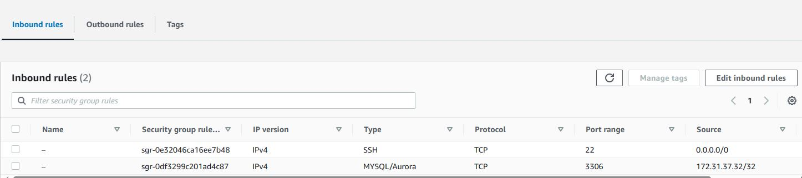

5. To connect Client Server, We need to configure MySQL-Server to allow connection from remote host

    'sudo vi /etc/mysql/mysql.conf.d/mysqld.cnf '

Replace '127.0.0.1' to '0.0.0.0'

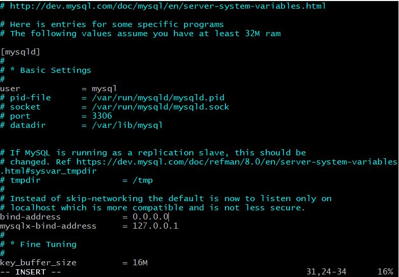

6. On MySQL server create a user and a password for root user

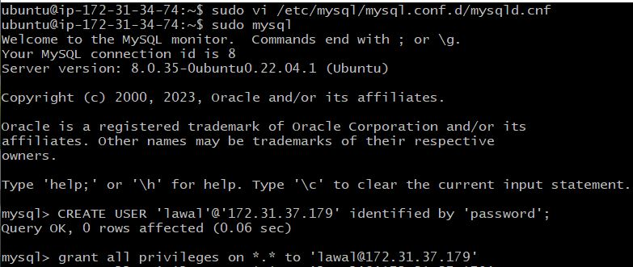

7. Grant privileges and flush privileges

8. To select if user created is on the database

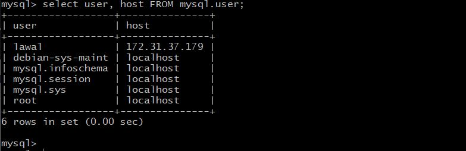

9. Exit MySQL and restart the mySQL server using 

        'sudo systemctl restart mysql.service'

10. Then From the client server run mysql -u lawal -p -h 172.31.34.74 using the private Ip to connect to a remote MySQL server and can perform SQL queries:

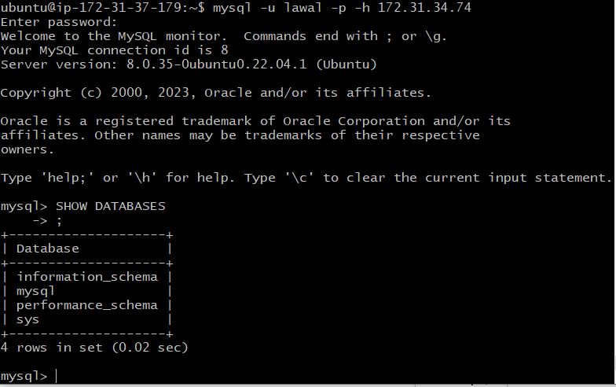

END OF PROJECT 

