# IMPLEMENTING LOADBALANCERS WITH NGNIX

## Introduction to load Balancing and Nginx

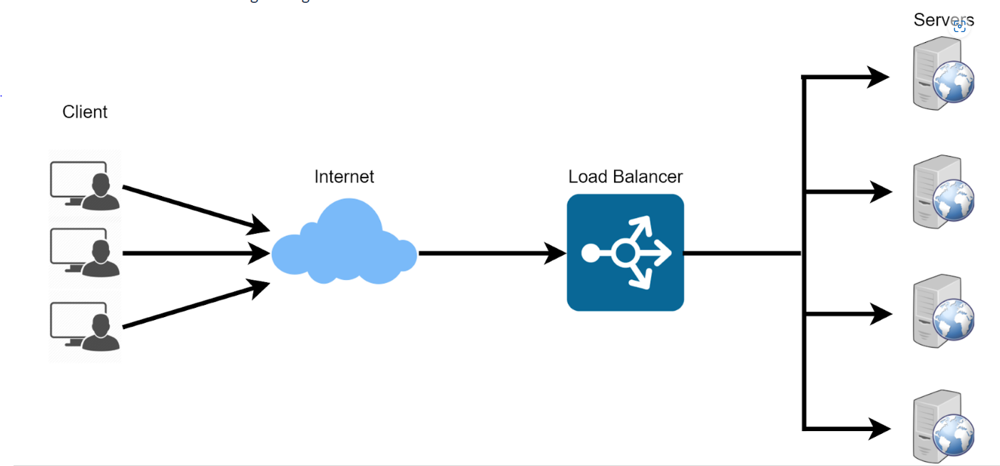

### What is a load balancer?

A load balancer distributes workloads across multiple compute resources, such as virtual servers. Using a load balancer increases the availability and fault tolerance of your applications.

You can add and remove compute resources from your load balancer as your needs change, without disrupting the overall flow of requests to your applications.

The load balancer stands in front of the webserver and all traffic gets into it first, it then distribute the traffic evenly across the set of webservers. This ensures no webserver gets overworked,consequently improving performance.

Nginx is a versatile software it acts like a webserver,reverse proxy, and a load balancer etc. All that is needed is to configure it properly to serve your use case.

## Prerequisite

STEP-1 Provisioning two EC2 Instance running on Ubuntun 22.4 and install apache webserver in them, and provision another EC2 Instance for Nginx and configure it to act as load balancer distributing traffic across the webservers.

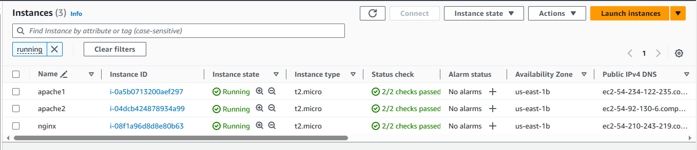

STEP-2 Open Port 8000 for running our webservers to allow traffic from anywhere while the load balancer runs on port 80. To do this we need to add a rules to the security group of each of our websers.

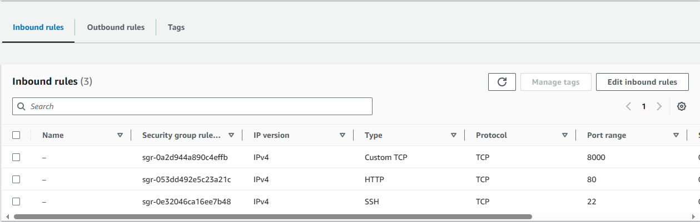

STEP-3 Install Apache Webserver, after provisioning both of our server and have open the necessary ports we install apache software on both server

- Install apache with the below commands;

        sudo apt update -y &&  sudo apt install apache2 -y

for webserver one and two 

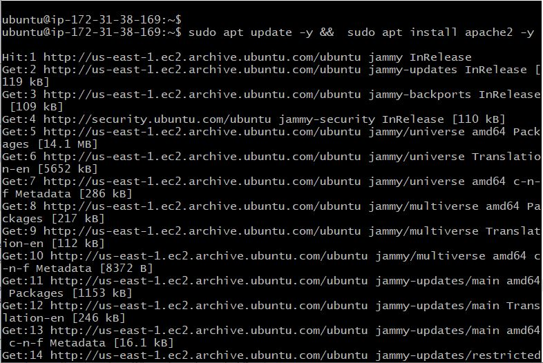

- Verify that apache is running on both using the below commands;

        sudo systemctl status apache2

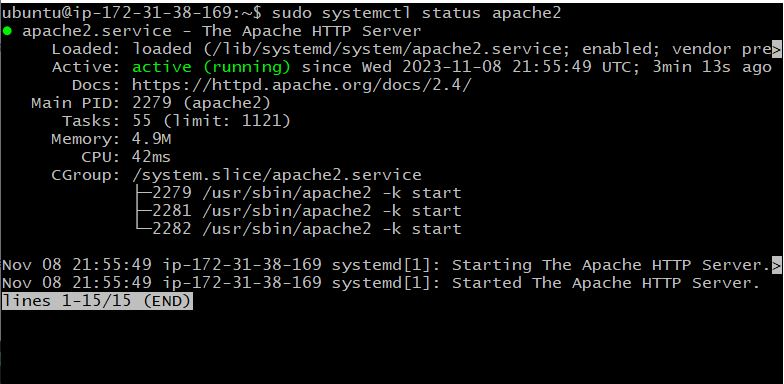

STEP-4 Configuring Apache webservers to serve content on port 8000 instead of the default port which is port 80. Then we will create new index.html file. The file contain code to display the public Ip address of the Ec2 instances . We will then override apache webserver default html file with the new file

- To configure Apache to serve content on port 8000 

         sudo vi /etc/apache2/ports.conf 

For both webserver

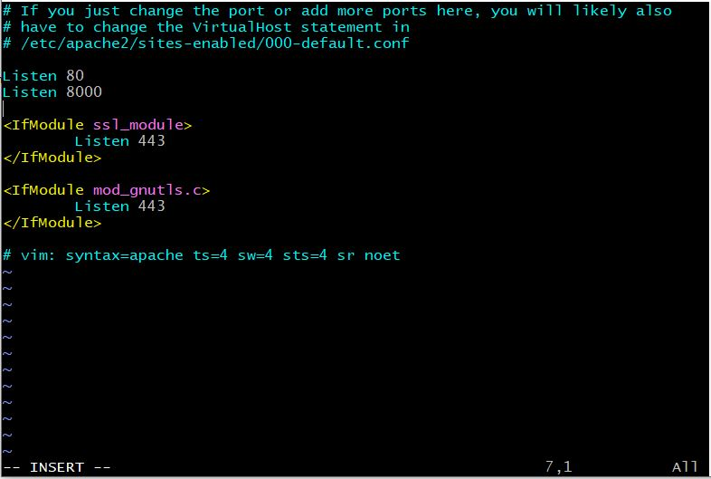

- To open the file /etc/apache2/sites-available/000-default.conf and change port;80 on the virtual host to port;8000.

         sudo vi /etc/apache2/sites-available/000-default.conf

For both webserver

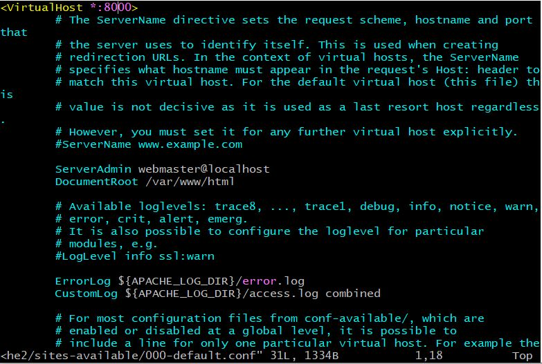

Then Reload or Restart Apache to the new configuration using the command Below;

         sudo systemctl restart apache2 

- Creatiing a new index.html file

To open a new index.html file;

         sudo vi index.html

paste the code below and get the public Ip address to replace the placeholder text for Ip address in the html file.

        <!DOCTYPE html>
        <html>
        <head>
            <title>My EC2 Instance</title>
        </head>
        <body>
            <h1>Welcome to my EC2 instance</h1>
            
Public IP: YOUR_PUBLIC_IP

        </body>
        </html>

For server one

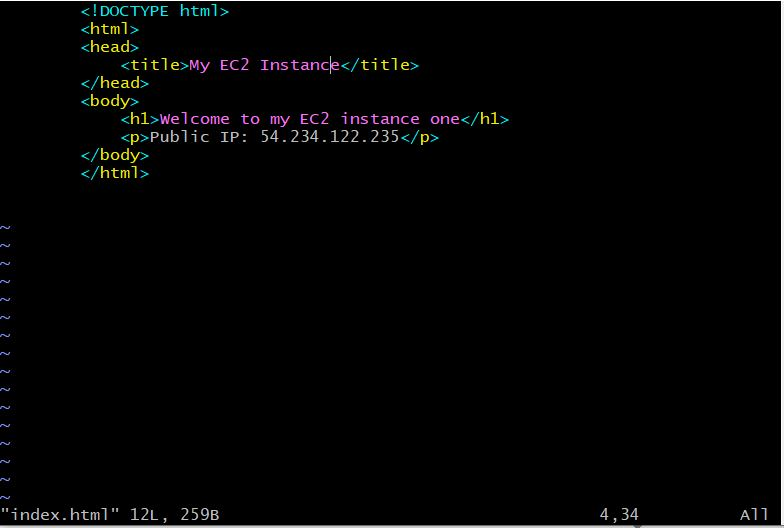

For server two

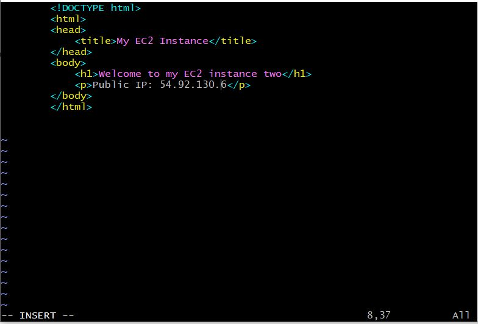

- Change the file ownership of index.html

Run sudo chown www-data:www-data ./index.html

- Overriding the default HTML file of the apache webserver

Replace the the default html file with our new html 

        Run sudo cp -f ./index.html /var/www/html/index.html

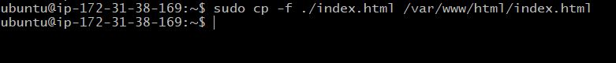

Restart webserver to laod the new configuration using the command below;

        Run sudo systemctl restart apache2 

RESULT of the two webserver on the web browser; 

STEP-5 CONFIGURING NGINX AS LOAD BALANCER

- Create an EC2 Instance running on Ubuntu 22.4

- Open Port 80 to allow trafic from anywhere

- SSh into the instance via the Terminal

### INSTALLING NGINX

- To Install Nginx Run the below commands; 

    sudo apt update -y && sudo apt install nginx -y

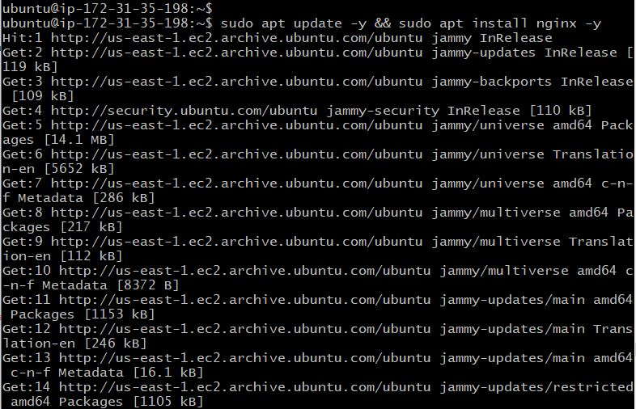

- TO Verify that Nginx is installed successfully run commands below;

        sudo systemctl status nginx

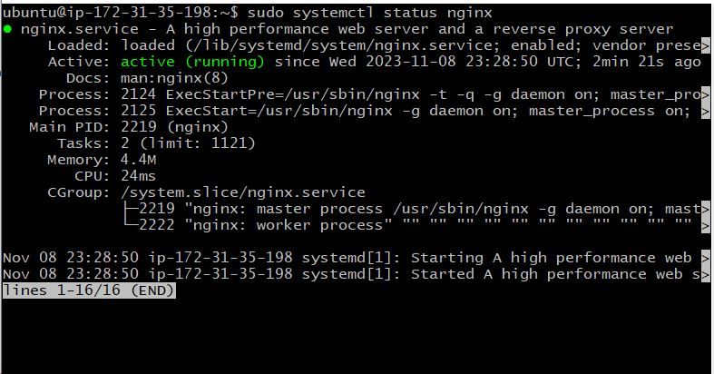

- Open a configuration file and paste the code for nginx to act as a load-balancer

- run commands below to open the file;

        sudo vi /etc/nginx/conf.d/loadbalancer.conf

- Paste the confinguration file below to configure nginx to act like a load balancer

        
        upstream backend_servers {

            # your are to replace the public IP and Port to that of your webservers
            server 127.0.0.1:8000; # public IP and port for webserser 1
            server 127.0.0.1:8000; # public IP and port for webserver 2

        }

        server {
            listen 80;
            server_name <your load balancer's public IP addres>; # provide your load balancers public IP address

            location / {
                proxy_pass http://backend_servers;
                proxy_set_header Host $host;
                proxy_set_header X-Real-IP $remote_addr;
                proxy_set_header X-Forwarded-For $proxy_add_x_forwarded_for;
            }
        }
    
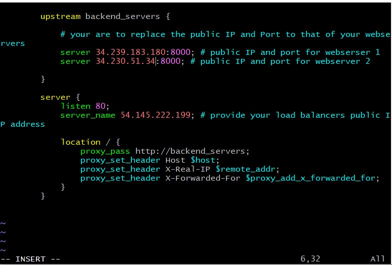

- Test the configuration with the the commands below;

        sudo nginx -t

Restart nginx if there are no erros, to load the new configuration with the commands below;

        sudo systemctl restart nginx
        

- In the web browser paste the Ip-address of the Nginx load balancer and reload

- If you see the webpages served by the webservers below, then the load balancer is working properly.

