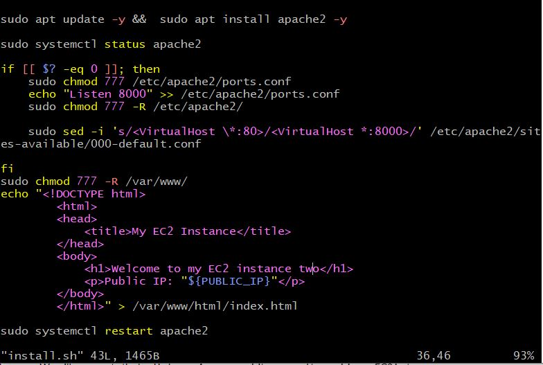

# AUTOMATING LOAD-BALANCER CONFIGURATION WITH SHELL SCRIPTING

## As a DevOps Engineer, automation is the core of our responsibility. Automation helps speed up deployment of services and reduces the chances of error in day to day activities in the CI/CD process.

### Prerequisite;

- Create two EC2 Instancces

- Install apache webserver on both virtual machine

- Insatll Nginx-load balancer on another  virtual machine.

STEP-1 Deploying and Configuring the Webservers

- In this case Webserver-1 and Webserver-2 are created respectively

- Open port 8000 and allow traffic from anywhere. (0.0.0.0) 

webserver 1

webserver 2 

Port 8000 open on the security group

- Connect both virtual servers to Terminal via ssh 

cd into Downloads where the ssh key is located

Copy the ssh client and paste on the terminal.

webserver 1 Terminal

webserver 2 Terminal

STEP-2 Deploy and run the webservers

- Open a file name install.sh using Vi-editor

- Run sudo vi install.sh

- Paste the following script

            #!/bin/bash

        ####################################################################################################################
        ##### This automates the installation and configuring of apache webserver to listen on port 8000
        ##### Usage: Call the script and pass in the Public_IP of your EC2 instance as the first argument as shown below:
        ######## ./install_configure_apache.sh 127.0.0.1
        ####################################################################################################################

        set -x # debug mode
        set -e # exit the script if there is an error
        set -o pipefail # exit the script when there is a pipe failure

        PUBLIC_IP=$1

        [ -z "${PUBLIC_IP}" ] && echo "Please pass the public IP of your EC2 instance as an argument to the script" && exit 1

        sudo apt update -y &&  sudo apt install apache2 -y

        sudo systemctl status apache2

        if [[ $? -eq 0 ]]; then
            sudo chmod 777 /etc/apache2/ports.conf
            echo "Listen 8000" >> /etc/apache2/ports.conf
            sudo chmod 777 -R /etc/apache2/

            sudo sed -i 's/<VirtualHost \*:80>/<VirtualHost *:8000>/' /etc/apache2/sites-available/000-default.conf

        fi
        sudo chmod 777 -R /var/www/
        echo "<!DOCTYPE html>
                <html>
                <head>
                    <title>My EC2 Instance</title>
                </head>
                <body>
                    <h1>Welcome to my EC2 instance</h1>
                    
Public IP: "${PUBLIC_IP}"

                </body>
                </html>" > /var/www/html/index.html

        sudo systemctl restart apache2

webserver 1 

webserver 2 

- Save and exit the text editor, Run ESCAPE KEY + :wq! + ENTER-KEY

STEP-3 Change the permission on the file to make an executable using the commands below;

    sudo chmod +x install.sh

STEP-4 Run the script with the commands below;

    ./install.sh PUBLIC_IP

webserver 1

 

webserver 2 

- Result on the web browser 

STEP-5 DEPLOYING AND CONFIGURING NGINX LOAD BALANCER

- Launch an EC2 Instance on Ubuntu 22.4 distribution

Connect Ec2 Instance to Terminal using Ssh client 

STEP-6 Open a file nginx.sh by running sudo vi nginx.sh

- Copy and paste the code below;

   
        #!/bin/bash

        ######################################################################################################################
        ##### This automates the configuration of Nginx to act as a load balancer
        ##### Usage: The script is called with 3 command line arguments. The public IP of the EC2 instance where Nginx is installed
        ##### the webserver urls for which the load balancer distributes traffic. An example of how to call the script is shown below:
        ##### ./configure_nginx_loadbalancer.sh PUBLIC_IP Webserver-1 Webserver-2
        #####  ./configure_nginx_loadbalancer.sh 127.0.0.1 192.2.4.6:8000  192.32.5.8:8000
        ############################################################################################################# 

        PUBLIC_IP=$1
        firstWebserver=$2
        secondWebserver=$3

        [ -z "${PUBLIC_IP}" ] && echo "Please pass the Public IP of your EC2 instance as the argument to the script" && exit 1

        [ -z "${firstWebserver}" ] && echo "Please pass the Public IP together with its port number in this format: 127.0.0.1:8000 as the second argument to the script" && exit 1

        [ -z "${secondWebserver}" ] && echo "Please pass the Public IP together with its port number in this format: 127.0.0.1:8000 as the third argument to the script" && exit 1

        set -x # debug mode
        set -e # exit the script if there is an error
        set -o pipefail # exit the script when there is a pipe failure

        sudo apt update -y && sudo apt install nginx -y
        sudo systemctl status nginx

        if [[ $? -eq 0 ]]; then
            sudo touch /etc/nginx/conf.d/loadbalancer.conf

            sudo chmod 777 /etc/nginx/conf.d/loadbalancer.conf
            sudo chmod 777 -R /etc/nginx/

            
            echo " upstream backend_servers {

                    # your are to replace the public IP and Port to that of your webservers
                    server  "${firstWebserver}"; # public IP and port for webserser 1
                    server "${secondWebserver}"; # public IP and port for webserver 2

                    }

                server {
                    listen 80;
                    server_name "${PUBLIC_IP}";

                    location / {
                        proxy_pass http://backend_servers;   
                    }
            } " > /etc/nginx/conf.d/loadbalancer.conf
        fi

        sudo nginx -t

        sudo systemctl restart nginx

- Save and quit the editor, Run ESCAPE-KEY  + :wq! + ENTER-KEY

STEP-7 Change the file permission and make it an executable file using the commands bellow;

        sudo chmod +x nginx.sh

STEP-8  Execute the script using the commands below;

    ./nginx.sh PUBLIC_IP Webserver-1 Webserver-2

i.e ./nginx.sh 52.90.208.195 18.208.246.249:8000  54.224.111.165:8000

- Result

 

 ## VERIFYING THE SET UP

