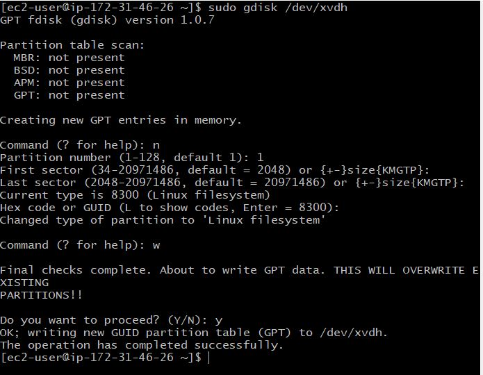

# IMPLEMENTING WORDPRESS WEBSITE WITH LOGIC VOLUME MANAGEMENT (LVM) STORAGE MANAGEMENT.

## Understanding 3 Tier Architecture.

## SCOPE :

- Configure storage substem for Web and Database servers based on Linux OS. Working with disks, Partitions and Volumes in Linux.

- Installing WordPress and connect it to a remote MySQL database server.Deploying Web and DB tiers of web solution.

## Three-tier Architecture

Generally, web or Mobile solutions are Implemented based on what is called Three-tier Architecture

1. Presentation Layer(PL): This is the user interface such as the client server or browser on your Laptops.

2. Business Layer(BL): This is the backened program that implements bsiness logic. Application or webserver.

3. Data Access or Management Layer(DAL): This is the layer for the computer data storage and data access.. Database server or File system such as FTP server or NFs server.

Prerequisite ;

1. A laptop or Pc to serve as a client
2. An EC2 Linux Server as web server (This is where you will install Wordpress)
3. An EC2 Linux Server as a database(DB) server.

## Implementing LVM on Linux servers(Web and Database servers)

STEP-1  Prepare a Web Server;

- Launch an EC2 instance that will serve as "Web Server"

- Create 3 Volumes in the same AZ as your Web server each of 10gigs

- Launching an EC2 Instance called Web-Server with a Redhat OS

Creating a volume of 10gibs

- To attach each Volume one by one to the Webserver EC2 Instance

- Click on the Volume ID and click on action to select the attach instance.

- Select the Web-server EC2 instance created  and click attach

STEP-2 

- To connect the EC2 Instance to the Terminal via ssh client

- cd into downloads and paste the key ssh -i "Universal-key.pem" ec2-user@ec2-54-166-213-2.compute-1.amazonaws.com

- To inspect what block device is attached to the server. 

        Run lsblk

- To see all mount and free space on the web-server

        Run df -h

- To create a single partition on each of the disk using the gdisk Utility

Run sudo gdisk /dev/xvdf
Run a new entry by entering n and click the number of partition in this case 1
click yes to complete the process.

- To view the newly configured partition on each of the 3 disks

Run the lsblk utility

- To Install lvm2 package

        Run sudo yum install lvm2

- To check for available partition on the disks

        Run sudo lvmdiskscan

- To mark each of the three disks as physical Volumes(Pvs) to be used by LVM

        Run sudo pvcreate /dev/xvdf1

            sudo pvcreate /dev/xvdg1

            sudo pvcreate /dev/xvdh1

- To verify that the physical volume has been created successfully

        Run sudo pvs

- To add all the three Physical volumes(Pvs) to a Volume Group(VG). Name the VG webdata-vg

        Run sudo vgcreate webdata-vg /dev/xvdh1 /dev/xvdg1 /dev/xvdf1

  

- To Verify that the VG has been successfully Created

        Run sudo vgs

- To create 2 logical volumes.apps-lv(Use half of the Pv size), and logs-lv(Use the remaining space of the PV)

Note; Apps-lv will be used to store data for the website while,logs-lv will be used to store data for logs.

        Run sudo lvcreate -n apps-lv -L 14G webdata-vg

        sudo lvcreate -n logs-lv -L 14G webdata-vg

- To verify the logic Volumes has been created successfully

        Run sudo lvs

- To verify the entire set-up

        sudo vgdisplay -v #view complete setup - VG, PV, and LV

        sudo lsblk

-To format the logical Volumes with ext4 file system using mkfs.ext4

        Run sudo mkfs -t ext4 /dev/webdata-vg/apps-lv

        Run sudo mkfs -t ext4 /dev/webdata-vg/logs-lv

- To create /var/www/html directory to store websites file

        Run sudo mkdir -p /var/www/html

- To create /home/recovery/logs to store back up of the logs data

        Run sudo mkdir -p /home/recovery/logs

- To mount /var/www/html on apps -lv logical volume

        Run sudo mount /dev/webdata-vg/apps-lv /var/www/html/

- To back up files in the log directory /var/log into home/recovery/logs using the rsync utility

        Run sudo rsync -av /var/log/. /home/recovery/logs/

- To mount var/log on logs-lv logical volume

        Run sudo mount /dev/webdata-vg/logs-lv /var/log

To restore log files back into /var/log directory

        Run sudo rsync -av /home/recovery/logs/. /var/log

To update /etc/fstab so that the mount configuration will persist after restart

        Run sudo blkid and copy the UUID of the device to upate the /etc/fstab

- apps : UUID=1711d5c4-6cc4-4908-9bd8-d05c15a8f84e /var/www/html ext4 defaults 0 0

- logs :  UUID=e6f3bf7d-d2c2-4c8b-b5bc-1f8ee00f83d3 /var/log      ext4 defaults 0 0

        Run sudo vi /etc/fstab and paste the UUID

- To test the configuration and reload the Daemon

        Run sudo mount -a and sudo systemctl daemon-reload 

- To verify the set up is running well

        Run df -h

# Installing Wordpress and configuring it to use MySQL Database

STEP-3

- Preparing the database Server

- Repeating the same step above, BUt instead of apps-lv create db-lv and mount it into directory /db instead of /var/www/html

- Launch an EC2 instance DB-serveron redhart OS

- Create and attach 3-volumes to the DB-Server

To see the newly created devices

        Run lsblk

- To create a single partition on each of the 3 disks

        Run sudo gdisk /dev/xvdf
        Run sudo gdisk /dev/xvdg
        Run sudo gdisk /dev/xvdh

- To install the lvm2 package

        Run sudo yum install lvm2

- To mark each of the three disks as physical Volumes(Pvs) to be used by LVM

        Run sudo pvcreate /dev/xvdf1
        sudo pvcreate /dev/xvdg1
        sudo pvcreate /dev/xvdh1

- To add all the three Physical volumes(Pvs) to a Volume Group(VG). Name the VG webdata-vg

        Run sudo vgcreate webdata-vg /dev/xvdh1 /dev/xvdg1 /dev/xvdf1

- To create 2 logical volumes.db-lv(Use half of the Pv size), and logs-lv(Use the remaining space of the PV)

- Note; Apps-lv will be used to store data for the website while,logs-lv will be used to store data for logs.

        Run sudo lvcreate -n db-lv -L 14G webdata-vg
        sudo lvcreate -n logs-lv -L 14G webdata-vg

     

- To format the logical Volumes with ext4 file system using mkfs.ext4

        Run sudo mkfs -t ext4 /dev/webdata-vg/db-lv

 

 - To create /db directory to store websites file

        Run sudo mkdir -p /db
        
- To create /home/recovery/logs to store back up of the logs data

        Run sudo mkdir -p /home/recovery/logs

- To mount /db on db-lv logical volume

        Run sudo mount /dev/webdata-vg/db-lv /db

- To back up files in the log directory /var/log into home/recovery/logs using the rsync utility

        Run sudo rsync -av /var/log/. /home/recovery/logs/

- To mount var/log on logs-lv logical volume

        Run sudo mount /dev/webdata-vg/logs-lv /var/log

- To restore log files back into /var/log directory

        Run sudo rsync -av /home/recovery/logs/. /var/log

- To update /etc/fstab so that the mount configuration will persist after restart

        Run sudo blkid

- And copy the UUID of the device to upate the /etc/fstab

db : UUID=8c3444f6-1d25-4698-86e5-8c3aa875d8f8 /db ext4 defaults 0 0

logs :  UUID=987ba328-57c0-4e6f-ae17-193c76d158f6 /var/log      ext4 defaults 0 0

        Run sudo vi /etc/fstab and paste the UUID

       

- To test the configuration and reload the Daemon

        Run sudo mount -a and sudo systemctl daemon-reload

- To verify the set up is running well

        Run df -h

## Installing Wordpress to use MySQL Database

STEP-3

### To Install Wordpress on Webserver E2

- Update the reprository using command below; 

        sudo yum -y update

- To install Apache, wget and its dependencies

        Run sudo yum -y install wget httpd php php-mysqlnd php-fpm php-json

- To start apache

        Run sudo sytemctl start httpd
        Run sudo systemctl enable httpd

- To install PHP and its dependencies

        Run
        sudo yum install https://dl.fedoraproject.org/pub/epel/epel-release-latest-8.noarch.rpm
        sudo yum install yum-utils http://rpms.remirepo.net/enterprise/remi-release-8.rpm
        sudo yum module list php
        sudo yum module reset php
        sudo yum module enable php:remi-7.4
        sudo yum install php php-opcache php-gd php-curl php-mysqlnd
        sudo systemctl start php-fpm
        sudo systemctl enable php-fpm
        setsebool -P httpd_execmem 1

- To restart apache

        Run sudo sytemctl start httpd
        Run sudo systemctl enable httpd

- To downlaod Wordpress and copy wordpress to var/www/html

        Run
        mkdir wordpress
        cd   wordpress
        sudo wget http://wordpress.org/latest.tar.gz
        sudo tar xzvf latest.tar.gz
        sudo rm -rf latest.tar.gz
        sudo cp wordpress/wp-config-sample.php wordpress/wp-config.php
        sudo cp -R wordpress /var/www/html/

- To configure SElinux Policies

        Run
        sudo chown -R apache:apache /var/www/html/wordpress
        sudo chcon -t httpd_sys_rw_content_t /var/www/html/wordpress -R
        sudo setsebool -P httpd_can_network_connect=1

## Installing wordpress and cofiguring it to use MYSQL DATABASE

- To update and Install mysql-server

        Run
        sudo yum update
        sudo yum install mysql-server

- To verify if the set-up is running

        Run sudo systemctl status mysqld

### Configure DB to work with Wordpress

- To configure DB to work with Wordpress

        Run
        sudo mysql
        CREATE DATABASE wordpress1;
        CREATE USER `myuser`@`172.31.24.93` IDENTIFIED BY 'mypass';
        GRANT ALL ON wordpress1.* TO 'myuser1'@'172.31.24.93';
        FLUSH PRIVILEGES;
        SHOW DATABASES;
        exit

### configure wordpress to connect to remote database

- Open MYSQL port 3306 on DB-server and access it only from web-servers Private IP address

### To Install MySQL client and test that you can connect from Web-server to DB-server using mysql-client

        Run
        sudo yum install mysql
        sudo mysql -u admin -p -h <DB-Server-Private-IP-address>

        sudo yum install mysql sudo mysql -u myuser -p -h 172.31.24.93

- cd into /var/www/html directory and ls

- cd into wordpress and ls

        Run sudo vi wp-config.php

- Edit the following; DB NAME, DB USER, DB PASSWORD, AND DB HOST

        Run sudo systemctl restart httpd

- T0 access wordpress from browser

        Run http://<web-server public-Ip address>/wordpress/

